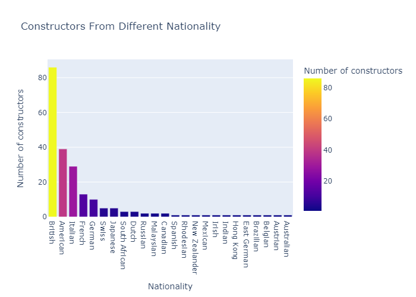
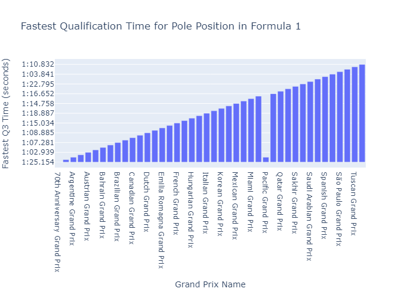

# F1 Exploratory Data Analysis Using SQL & Tableau

  

Explore the exciting world of Formula 1 through this Exploratory Data Analysis (EDA) project conducted using SQL. The dataset provides a comprehensive overview of Formula 1 races, circuits, drivers, and constructors, allowing us to uncover insightful patterns and statistics. 

The project encompasses a variety of SQL queries, each designed to extract valuable information and generate meaningful visualizations. As you navigate through the analysis, you'll gain a deeper understanding of Formula 1's historical and competitive landscape.

We Perform EDA on given Formula 1 dataset using SQL, and find answers to different queries:

# 1. Finding Locations That Hosted Maximum Number Of Races
Identifying the venues that have hosted the highest number of Formula 1 races, shedding light on the most prominent locations in the sport's history.

](Plot-png/plot1.png)

# 2. Finding Circuits That Hosted Opening Races In Each Season
Pinpointing the circuits that hosted the inaugural races of Formula 1 seasons, showcasing the historical significance of these tracks.

](Plot-png/plot2.png)

# 3. Number Of Races Hosted By Every Country
Exploring the distribution of Formula 1 races across different countries, providing insights into the global reach and popularity of the sport.

](Plot-png/plot3.png)

# 4. All-Time Constructor Points and Leaders 
Analyzing the cumulative constructor points earned by teams over the years, unveiling the leading constructors in Formula 1 history.

](Plot-png/plot4.png)

# 5. Number Of Races Organized Per Season
Investigating the variability in the number of races organized per Formula 1 season, highlighting any trends or patterns.

](Plot-png/plot5.png)

# 6. Comparison Of All-Time Top 10 Teams(Based On Points and Races Won)
Comparing the performance of the all-time top 10 teams, considering both total points accumulated and the number of races won.

](Plot-png/plot6.png)

# 7. Number Of Races Organized Per Season
Uncovering the dominance of the top 10 drivers in Formula 1 by examining the number of races they have won throughout their careers.

](Plot-png/plot7.png)

# 8. Finding The Fastest Laps On Each Circuit 
Identifying the fastest laps recorded on each circuit, showcasing the drivers' exceptional speed and performance at specific tracks.

](Plot-png/plot8.png)

# 9. Number Of Constructors From Each Country 
Examining the distribution of Formula 1 constructors based on their respective countries, offering insights into the international composition of teams.

](Plot-png/plot9.png)

# 10. Finding The Fastest Qualification Times On Every Circuit For Pole Position
Exploring the fastest qualification times on each circuit, showcasing the drivers who secured pole position with the quickest laps.

](Plot-png/plot10.png)

# 11. Drivers Who Have Won At Least Once Race 
Compiling a list of drivers who have achieved the prestigious feat of winning at least one Formula 1 race, highlighting the diverse talent in the sport's history.

](Plot-png/plot11.png)